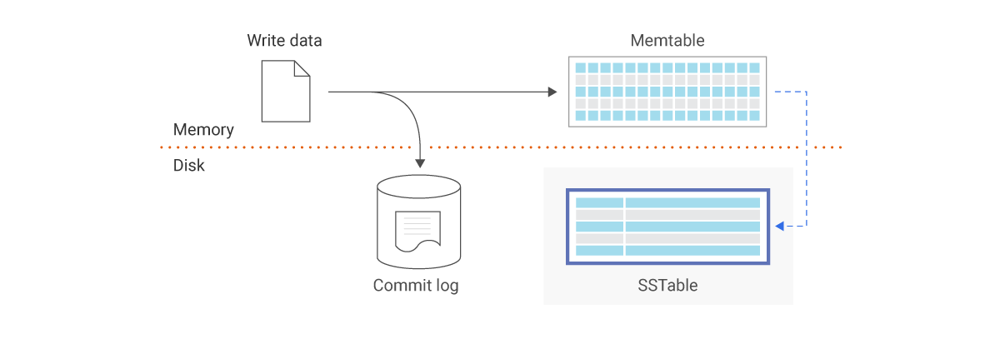

# Pack Rat

> Pack rats are nest builders. They use plant material such as twigs, sticks, and other available debris. They are
> particularly fond of shiny objects. A peculiar characteristic is that if they find something they want, they will drop
> what they are currently carrying—for example, a piece of cactus—and "trade" it for the new item.

`Pack Rat` is a small [LSM](https://en.wikipedia.org/wiki/Log-structured_merge-tree) (Log Structured Merge) database
engine that supports
the [RESP](https://redis.io/docs/latest/develop/reference/protocol-spec/) protocol. Pack Rat's often build nests which
are akin to building out a log
structured merge tree using SSTables. I recently started writing this database engine in Java but naturally I switched
to rust; another call back to Pack Rat's
which will drop something old to pick up something new and shiny. Pack Rat has a few components to it.

- WAL (Write Ahead Log) for commits
- SSTable for storing data on disk
- Memtable for storing data in memory
- Offset index file
    - Indexes are as follows (key, offset inside SSTable file on disk)

### SSTables?

SSTable's are an indexing strategy used within LSM datastore's. It's a pretty simple methodology. There are two parts to
SSTables:

1. An in memory data structure called a Memtable
2. Files on disk called SSTables

Data is written to the Memtable. Once the Memtable hits a certain threshold the data
is
serialized and written to an SSTable file on disk. This process continues over and over again. This causese a build
up
of SSTables on disk.

